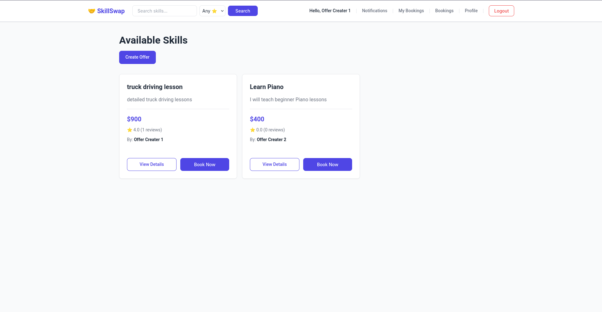
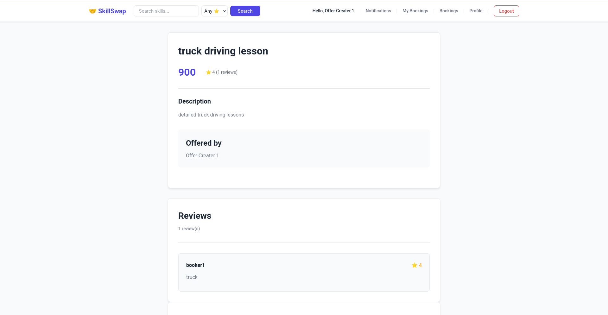
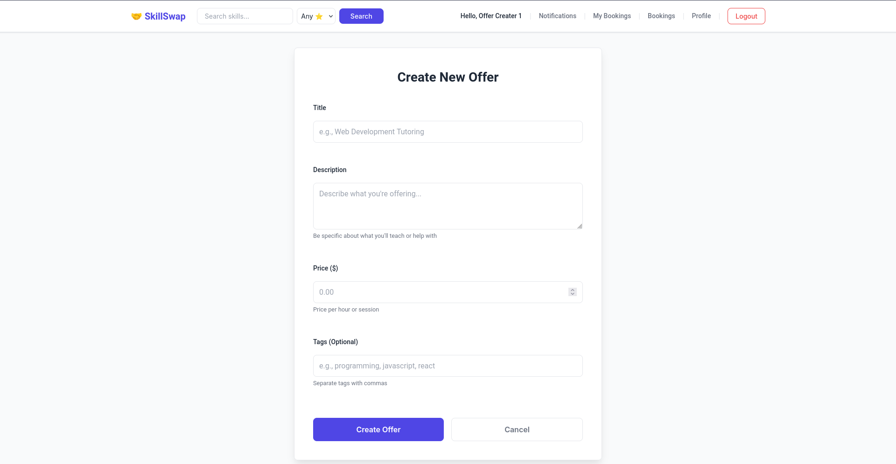
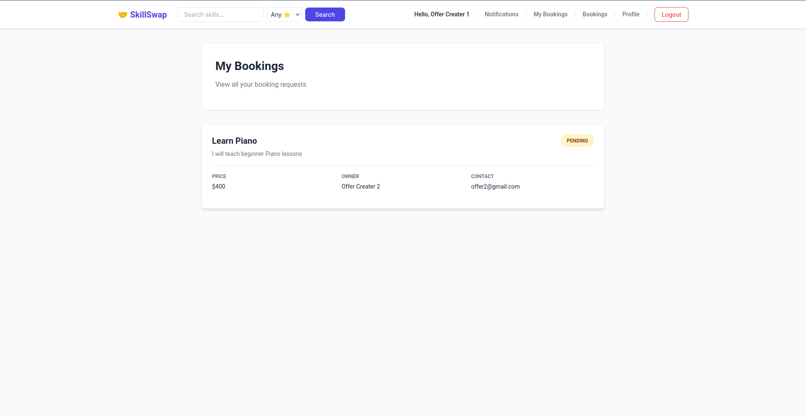
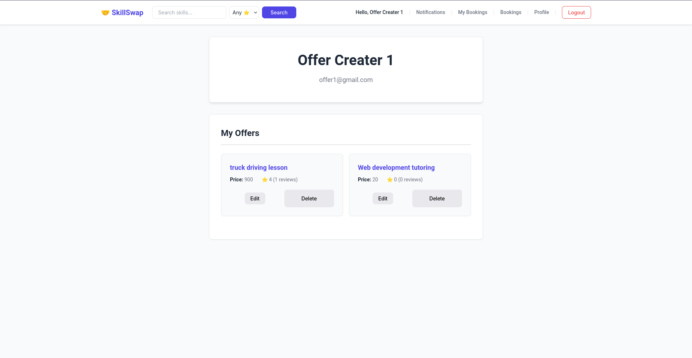

# LocalSkillSwap

A full-stack web application that enables users to share and exchange skills within their local community. Users can create skill offerings, book sessions with other users, leave reviews, and manage their bookings through an intuitive interface.

## Screenshots

### Home Page - Browse Offers


_Browse through available skill offerings in your community_

### Offer Details


_View detailed information about a skill offering including ratings and reviews_

### Create Offer


_Share your skills by creating a new offering_

### My Bookings


_Manage your booked sessions and leave reviews_

### Owner Bookings


_View and manage booking requests for your skill offerings_

### Notifications


_Stay updated with booking confirmations and status changes_

### User Profile


_View and manage your profile and offerings_

## Features

- **User Authentication**: Secure registration and login with JWT-based authentication
- **Skill Offerings**: Create, edit, and delete skill offerings with details like title, description, category, and location
- **Smart Booking System**: Request bookings for skills you want to learn with status tracking (pending, confirmed, completed, cancelled)
- **Review & Rating System**: Leave reviews and ratings after completing sessions, with automatic offer rating calculation
- **Real-time Notifications**: Get notified about booking status changes and system updates
- **User Profiles**: View and manage your personal information and offerings
- **Protected Routes**: Secure access to authenticated-only features
- **Responsive Design**: Mobile-friendly interface that works on all devices
- **Search & Filter**: Browse and discover skills by category and location

## Tech Stack

### Frontend

- **React 19** - Modern UI library
- **React Router DOM** - Client-side routing
- **Axios** - HTTP client for API requests
- **Vite** - Fast build tool and dev server
- **CSS3** - Custom styling

### Backend

- **Node.js** - JavaScript runtime
- **Express 5** - Web application framework
- **MongoDB** - NoSQL database
- **Mongoose** - MongoDB object modeling
- **JWT** - JSON Web Tokens for authentication
- **bcryptjs** - Password hashing
- **CORS** - Cross-origin resource sharing

## Prerequisites

Before running this project, make sure you have the following installed:

- Node.js (v14 or higher)
- MongoDB (local or MongoDB Atlas account)
- npm or yarn package manager

## Installation & Setup

### 1. Clone the Repository

```bash
git clone https://github.com/Prabesh-Pandey/LocalSkillSwap.git
cd LocalSkillSwap
```

### 2. Backend Setup

```bash
# Navigate to backend directory
cd backend

# Install dependencies
npm install

# Create .env file
cp .env.example .env
```

Configure your `.env` file with the following variables:

```env
PORT=5000
MONGODB_URI=your_mongodb_connection_string
JWT_SECRET=your_jwt_secret_key
FRONTEND_URL=http://localhost:5173
```

```bash
# Start the backend server
npm run dev
```

The backend server will run on `http://localhost:5000`

### 3. Frontend Setup

Open a new terminal window:

```bash
# Navigate to frontend directory
cd frontend

# Install dependencies
npm install

# Start the development server
npm run dev
```

The frontend will run on `http://localhost:5173`

## Project Structure

```
LocalSkillSwap/
├── backend/
│   ├── config/
│   │   └── db.js                 # MongoDB connection configuration
│   ├── controller/
│   │   ├── authController.js     # Authentication logic
│   │   ├── bookingController.js  # Booking management
│   │   ├── notificationController.js
│   │   ├── offerController.js    # Offer CRUD operations
│   │   └── reviewController.js   # Review management
│   ├── middleware/
│   │   └── authMiddleware.js     # JWT verification
│   ├── models/
│   │   ├── User.js               # User schema
│   │   ├── Offer.js              # Offer schema
│   │   ├── Booking.js            # Booking schema
│   │   ├── Review.js             # Review schema
│   │   └── Notification.js       # Notification schema
│   ├── routes/
│   │   ├── authRoutes.js
│   │   ├── bookingRoutes.js
│   │   ├── offerRoutes.js
│   │   ├── reviewRoutes.js
│   │   └── notificationRoutes.js
│   ├── scripts/
│   │   └── recomputeOfferRatings.js
│   ├── utils/
│   │   └── GenerateToken.js      # JWT token generation
│   ├── .env
│   ├── package.json
│   └── server.js                 # Entry point
│
└── frontend/
    ├── public/
    ├── src/
    │   ├── api/
    │   │   └── axios.js           # Axios configuration
    │   ├── components/
    │   │   ├── Navbar.jsx         # Navigation bar
    │   │   ├── ProtectedRoute.jsx # Route protection
    │   │   └── ReviewForm.jsx     # Review submission form
    │   ├── context/
    │   │   └── AuthContext.jsx    # Authentication context
    │   ├── pages/
    │   │   ├── Login.jsx
    │   │   ├── Register.jsx
    │   │   ├── Offers.jsx         # Browse all offers
    │   │   ├── OfferDetails.jsx   # Single offer view
    │   │   ├── CreateOffer.jsx    # Create new offer
    │   │   ├── EditOffer.jsx      # Edit existing offer
    │   │   ├── MyBooking.jsx      # User's bookings
    │   │   ├── OwnerBookings.jsx  # Bookings for user's offers
    │   │   ├── Notifications.jsx  # User notifications
    │   │   └── Profile.jsx        # User profile
    │   ├── App.jsx                # Main app component
    │   ├── main.jsx               # Entry point
    │   └── index.css              # Global styles
    ├── package.json
    ├── vite.config.js
    └── index.html
```

## API Endpoints

### Authentication

- `POST /api/auth/register` - Register a new user
- `POST /api/auth/login` - Login user
- `GET /api/auth/profile` - Get user profile (protected)
- `PUT /api/auth/profile` - Update user profile (protected)

### Offers

- `GET /api/offers` - Get all offers
- `GET /api/offers/:id` - Get single offer
- `POST /api/offers` - Create new offer (protected)
- `PUT /api/offers/:id` - Update offer (protected)
- `DELETE /api/offers/:id` - Delete offer (protected)
- `GET /api/offers/user/:userId` - Get user's offers

### Bookings

- `GET /api/bookings/my-bookings` - Get user's bookings (protected)
- `GET /api/bookings/owner-bookings` - Get bookings for user's offers (protected)
- `POST /api/bookings` - Create new booking (protected)
- `PUT /api/bookings/:id` - Update booking status (protected)
- `DELETE /api/bookings/:id` - Cancel booking (protected)

### Reviews

- `GET /api/reviews/offer/:offerId` - Get reviews for an offer
- `POST /api/reviews` - Create review (protected)
- `PUT /api/reviews/:id` - Update review (protected)
- `DELETE /api/reviews/:id` - Delete review (protected)

### Notifications

- `GET /api/notifications` - Get user's notifications (protected)
- `PUT /api/notifications/:id/read` - Mark notification as read (protected)
- `DELETE /api/notifications/:id` - Delete notification (protected)

## Usage

1. **Register/Login**: Create an account or log in to access the platform
2. **Browse Offers**: Explore available skill offerings on the home page
3. **View Details**: Click on any offer to see full details, reviews, and ratings
4. **Create Offer**: Share your skills by creating a new offering
5. **Book a Session**: Request to book a skill you want to learn
6. **Manage Bookings**:
   - View your bookings in "My Bookings"
   - Manage incoming requests in "Owner Bookings"
7. **Leave Reviews**: After completing a session, leave a review and rating
8. **Stay Updated**: Check notifications for booking updates
9. **Profile Management**: Update your profile information

## Security Features

- Password hashing with bcryptjs
- JWT-based authentication
- Protected routes and API endpoints
- Input validation and sanitization
- CORS configuration for secure cross-origin requests

## Key Highlights

- **Automatic Rating Calculation**: Offer ratings are automatically computed from all reviews
- **Status-based Workflow**: Bookings follow a clear workflow (pending → confirmed → completed)
- **Conditional Reviews**: Users can only leave reviews for completed bookings
- **Real-time Updates**: Notifications keep users informed of all booking activities
- **Owner Controls**: Offer creators can accept/reject bookings and manage their offerings
- **User-friendly UI**: Clean, intuitive interface with responsive design

## Future Enhancements

- [ ] Real-time chat between users
- [ ] Advanced search with filters
- [ ] Email notifications
- [ ] Payment integration
- [ ] Calendar integration for scheduling
- [ ] User verification system
- [ ] Skill categories with icons
- [ ] Upload photos for offers
- [ ] Location-based search with maps
- [ ] Social media sharing

## Author

[Prabesh Pandey](https://github.com/Prabesh-Pandey)

## Acknowledgments

- React and Vite communities for excellent documentation
- MongoDB for the robust database solution
- Express.js for the lightweight backend framework

---
